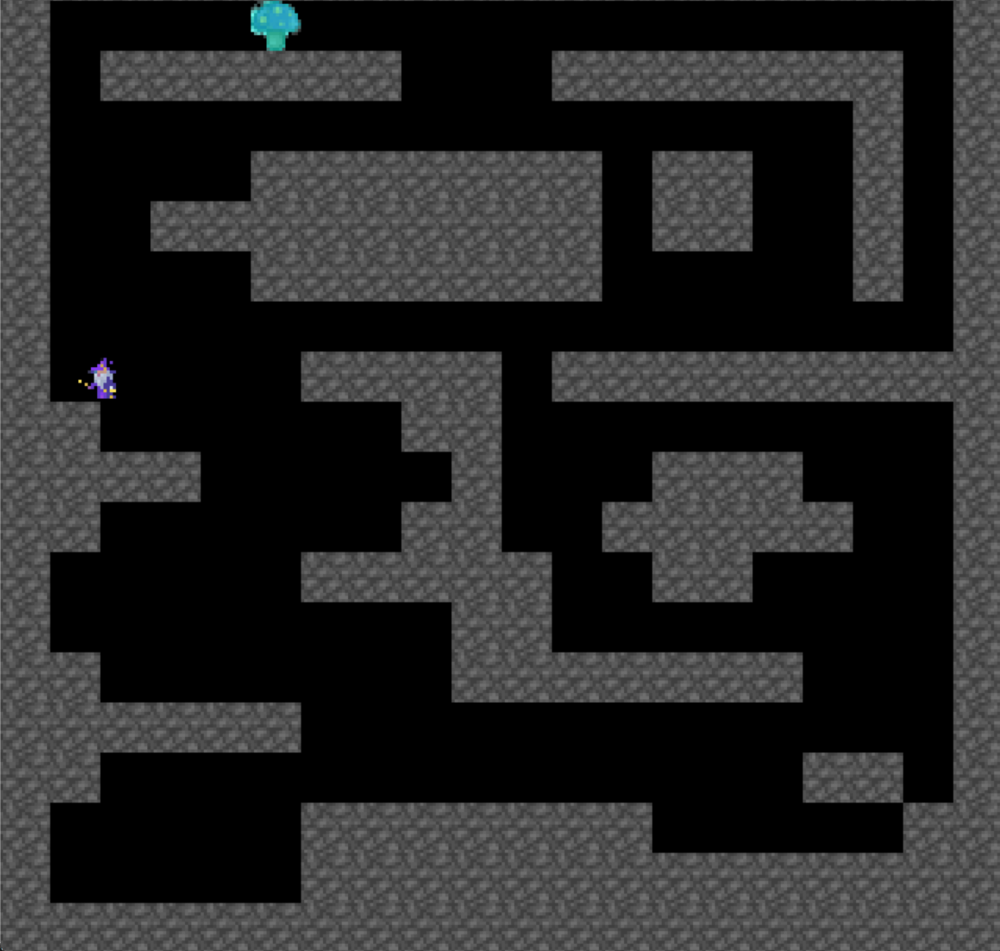

# magicmushroom

**Beschreibung:**

Mirakulus hat sich in einem unbekannten Gebiet, auf der Suche nach seinen Pilzen, um den Zaubertrank zu brauen, verlaufen und kann nur seinen Zaubertrank brauen, indem er Pilze einsammelt. Hilf ihm dabei und sammel soviel Pilze wie möglich einzusammeln bevor er zurück muss.

A -       Links

D -      Rechts

SPACE -   Springen 

```python
for i in range(69):
    print("Mirakulus braucht den Bubatz")
```

## Screenshots



